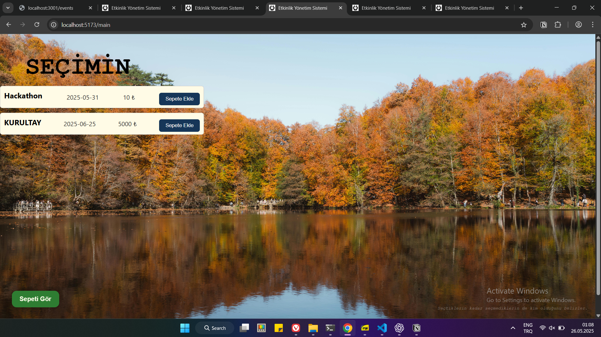
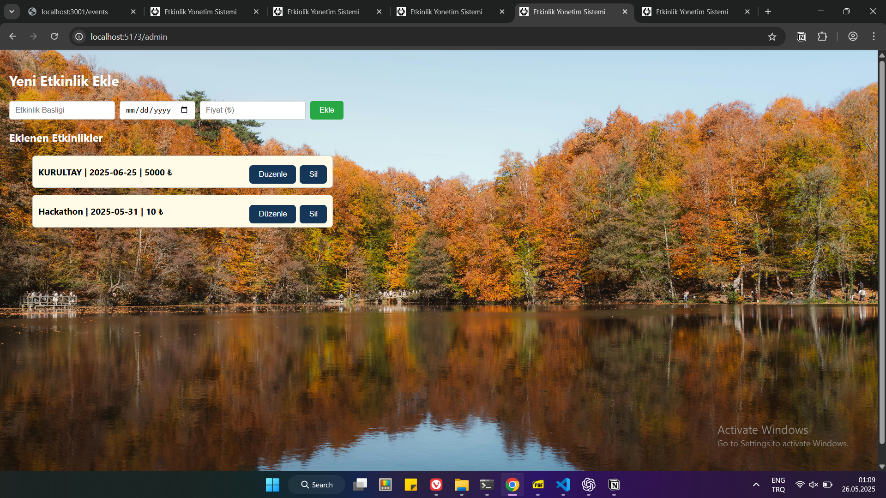
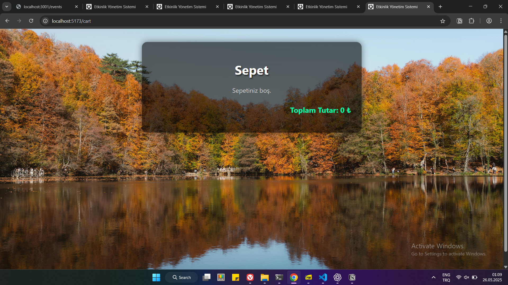

# 🎫 Etkinlik Yönetim Sistemi

React ve Express kullanılarak geliştirilen tam işlevli, dosya tabanlı bir etkinlik yönetim sistemi.

---

## 🚀 Özellikler

✔️ Kullanıcı kayıt ve giriş sistemi  
✔️ Admin onaylı kullanıcı kontrolü  
✔️ Etkinlik oluşturma, güncelleme, silme  
✔️ Sepete etkinlik ekleme ve listeleme  
✔️ Estetik, responsive arayüz

---

## 📷 Ekran Görüntüleri 

  
  
  
  

---

## 📦 Kurulum

1. Depoyu klonlayın:
```bash
git clone https://github.com/duces-14/etkinlik-yonetim.git
```

2. Backend dizinine geçin ve bağımlılıkları yükleyin:
```bash
cd backend
npm install
node index.js
```

3. Frontend dizinine geçin ve çalıştırın:
```bash
cd frontend
npm install
npm run dev
```

---

## 🧪 Kullanım

- `localhost:5173` üzerinden erişim sağlayın  
- Kayıt olun ve admin onayı bekleyin  
- Onaylandıktan sonra giriş yapıp etkinlikleri görüntüleyin  
- Etkinlikleri sepete ekleyip detayları görüntüleyin  
- Admin panelinden yeni etkinlik ekleyin, düzenleyin veya silin

---

## 🛠️ Kullanılan Teknolojiler

- ReactJS (Frontend)  
- ExpressJS (Backend)  
- NodeJS  
- JSON dosya sistemi (veritabanı yerine)  
- localStorage (kullanıcı oturumu saklama)  
- Harici CSS modülleri (estetik yapı)

---

## 📁 Proje Yapısı (Kök dizin altında)

```
backend/            -> Express sunucu, route ve controller dosyaları
│  ├── controllers/     -> authController.js, eventController.js
│  ├── routes/          -> authRoutes.js, eventRoutes.js
│  ├── data/            -> events.json & users.json (veri saklama)
│  └── server.js        -> Ana sunucu dosyası

frontend/           -> React uygulaması
│  ├── public/assets/   -> Arka plan görselleri (örneğin: yediGoller_Bolu.jpg)
│  ├── components/      -> Ortak bileşenler: EventCard, EditInlineForm, vb.
│  ├── pages/           -> LoginPage, RegisterPage, MainPage, AdminPanel, CartPage
│  ├── styles/          -> CSS dosyaları (login.css, main.css, cart.css, vs.)
│  ├── data/            -> events.js (başlangıçta mockdata içeriyordu)
│  └── App.jsx          -> Uygulama rotaları ve context bağlantısı

SS/                 -> README’de kullanılan ekran görüntüleri

README.md           -> Proje açıklaması ve kurulum yönergeleri
```

## 🧠 Öğrenme Notu

Bu projeyi planlarken bildiklerim ile değil bilmem gerekenler ile yol almayı tercih edip Frontend tarafında ReactJs, backend tarafında ise ExpressJs ve NodeJs kullandım.

Günümüz web teknolojilerinin birçoğu JavaScript türevleri olduğundan projeye başlamadan önce projede kullanacağım bilgiler kapsamında önden bir JS temeli atıp sonra ReactJs öğrenmeye ve uygulamaya geçtim. 

Bu projeyi yaparken kişisel bilgisayarımda  birkaç  yedek aldım ki bunlar projede benim açımdan eşik noktaları oldu. Bunları sırasıyla paylaşıp biraz da açıklamam gerekirse:

- 13.05.14_justMainPage , ilk önce sadece tek bir ana sayfa yaptım temel ve basit düzeyde.
- 13.05.18-pages klasörü ile birlikte etkinlik için kullanmam gereken sayfalardan ilk başta sadece login,main,admin olacak şekilde jsx dosyaları oluşturup ardından router ile birbirlerine bağladım.
- 20.05.15-localStorage , Veri tabanı bilmediğimden ve öğrenmek için de vaktim olmadığından kullanıcıların giriş yaptıktan sonra sistemde kalabilmesi için verileri geçici olarak tarayıcıda sakladım.
- 22.05.16-GETeventsBackend , ile mockData kullanımını bir kenara bırakıp dosya tabanlı kalıcı ve güncel veri saklamaya başladım.
- 22.05.19-GEtvePOST , CRUD açısından sadece Create(post) ve Read(get) tamamlandı.
- 23.05.12-CRUD TAMAMLANDI, Create (Oluştur), Read (Oku / Listele),
Update (Güncelle), Delete (Sil)

İşlemleri sonucunda dinamik bir yapıya geçtim.

- 24.05.16-User Approve - Onay sistemini oluşturdum. Giriş yapmadan önce yönetici onayını gerekli kıldım.
- 25.05.25-ESTETİK, Son zamanlarımda estetik üzerinde çalıştım. Bu noktada “styles” adlı bir klasörde harici CSS dosyaları oluşturup ilgili dosyalarda içe aktararak ,import ederek, görsel açıdan güzelliği ve sadeliği hedefledim.

Çalışmamda MVP (Minimum Viable Product) konseptini izledim. Amacım bitmeyen bir proje yerine işleyen bir sistem olmasının yanı sıra süreci kendi adıma olabildiğince anlamlı kılmak ve gerekirse projenin ihtiyaçlarını sağlayamayacak olsam da maksimum öğrenme çıktısı ile bu süreci tamamlamaktı.

---

## 🔒 Lisans

Bu proje açık kaynaklıdır. Tüm geliştirme süreci öğrenim amaçlıdır.
